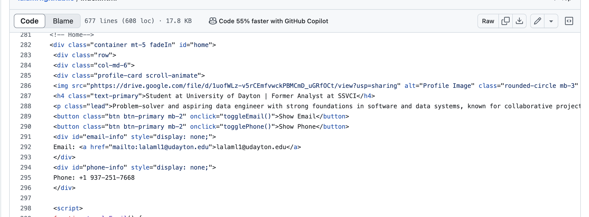
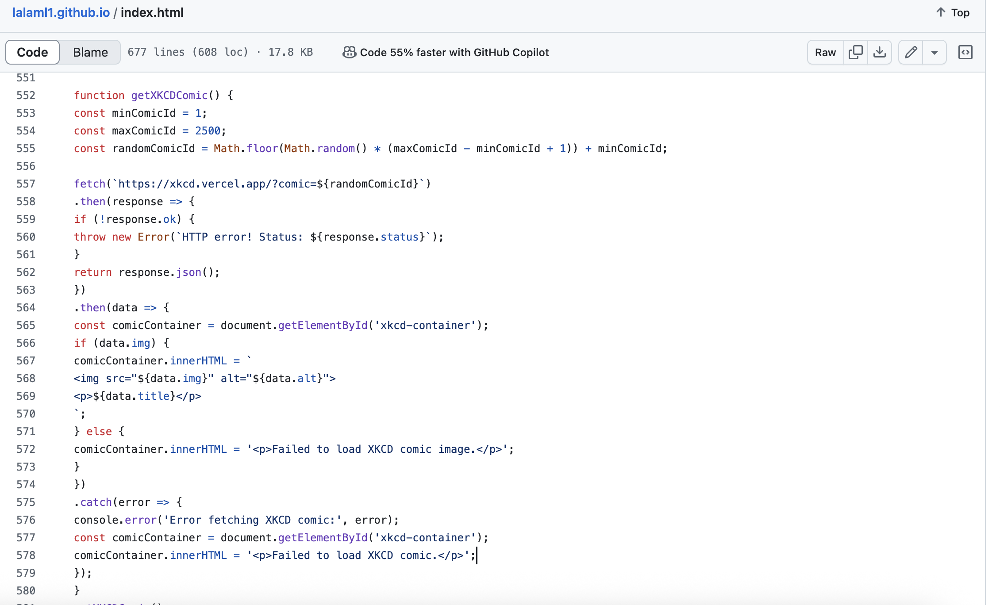

# WAPH-Web Application Programming and Hacking

## Instructor: Dr. Phu Phung

## Name: Lohit Naidu Lalam

# ID: 101825796
 

# Lab 1 - Foundations of the Web

## Report 

## The lab's overview

- The goal of this assignment was to create and launch a professional portfolio website that showcases my project work, abilities, experiences, and academic background. In addition, this website illustrates fundamental ideas covered in the Web Application Programming and Hacking course, including web development, GitHub deployment, JavaScript interactivity, API integration, and cookie handling.

I picked up information about how to:

 Build a personal website with Bootstrap and HTML5/CSS3.

 Utilize APIs to incorporate real-time content and dynamic JavaScript features.

 Keep your layout responsive and your design up to date.

 Website in real time: https://lalaml1.github.io/index.html

This is the GitHub repository: https://github.com/lalaml1/lalaml1.github.io

## Part 1- General Requirements 

## 1. Create and Deploy a Personal Website

- I develop and host a personal website with bootstrap responsiveness which implemented

- And i added sections like About Me, Resume, skills, Projects, eResume is on-page and also downloadable as a PDF.
Headshot image and real contact information included.

- Webpage hosted at GitHub Pages so the public can view it.

 
- I added hyperlinks for my skills which if we touch on the skills it will redirects to the skill related data.

- I have added hyperlinks to index.html amd resume.html

## 2 Add Course Intro Page 

- I have created a new page for web application course details and I named it as waph.html and I added the course details into that

- I also added the hyperlinks for some of them like professor mail and TA mail IDs which is easy by clicking on it redirects easily.

## Task 2: Non-Technical Requirements 

## part 1

- I have used bootstrap 5 from CDN to design different kind of representative layout which looks good and it also designs the navigation bars, profile cards, buttons and grids.

- Basically it was inserted in the <head> block of the html code.

- I have Included this bootstrap https://cdn.jsdelivr.net/npm/bootstrap@5.3.0/dist/css/bootstrap.min.css code in the head tag in every html code individually, so it runs the code good.

- And this made the website friendly and easy to navigate for everyone.

## part 2 : Page Tracker

- I used flag counter in the code and I also added tracker at the bottom of the code which helps that how many people visited the page.

- It shows the stats of the home page.

- I have used the url to integrate the flag counter is www.flagcounter.com

- We can customize different kinds of ways for the flag counter by defining the url bg_FFFFFF/txt_000000

## Task 3: Technical Requirements  

## part 1: Digital clock and Analog clock

- In this we are creating the digital clock and analog clock for the website in which I used the same code.

- It displays both analog and digital clock at one place.

- The time updates every second and it shows in the home page

## Show/Hide Email

- In this I wrote a function that allows users to show/Hide Email I'd and phone number.

- I have created a button and under that button I have added email id and mobile number inside the div tags.

- The link I injected in the code is 

## Stop Watch

- I had used the functionality stop Watch for the code.

- It includes the start, stop and reset buttons in the code which interacts with the display.

## Joke API

- I integrated the joke API which helps to provide a new joke for every minute in the website

- I included a disclaimer that the jokes and content are generated and we are not responsible for that.

- A new joke appears for every minute by using set interval and fetch APi.

## XKCD comics

- I used a which shows new comic image for every time when we refresh the page.

- It includes the image and comic tile in the page.

- It also added a note indicating that the content is from API .

## Weather API

- I have done integration of weather API using the Java script code in which it shows the current weather in your particular area

- I used a Java script fetch to get a current temperature, humidity and description of the current City.

- for creating the container I used 

- The weather which shows in the website I accurate and It is in real time.

## Java script code

- I used a cookie alert in the code to show the first and last visit where the time I shown in the top of the website

- cookie remembers the last visit of the website and I used the html to write the cookie alert to show inside a tag 

